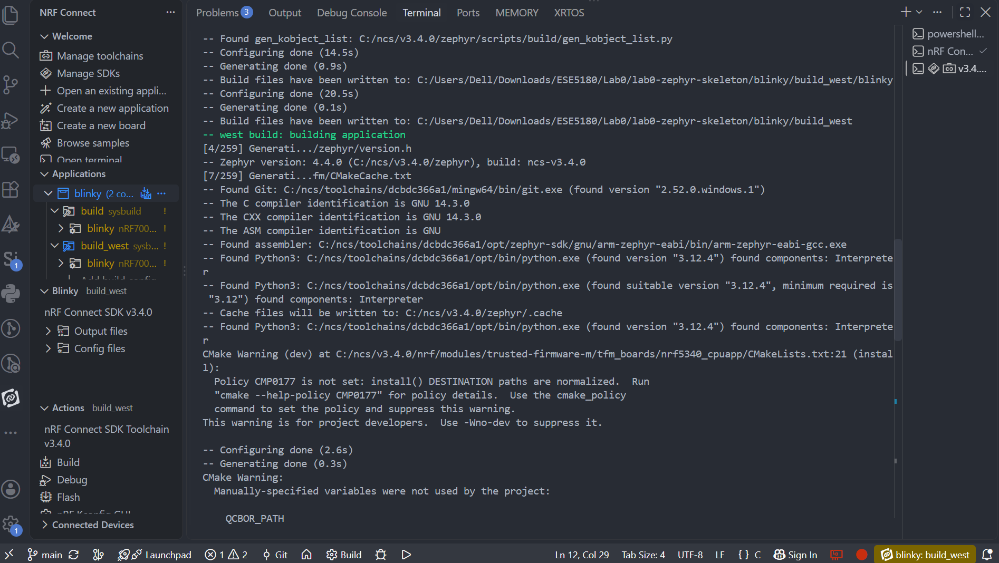
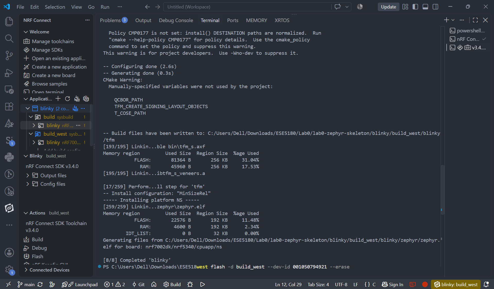
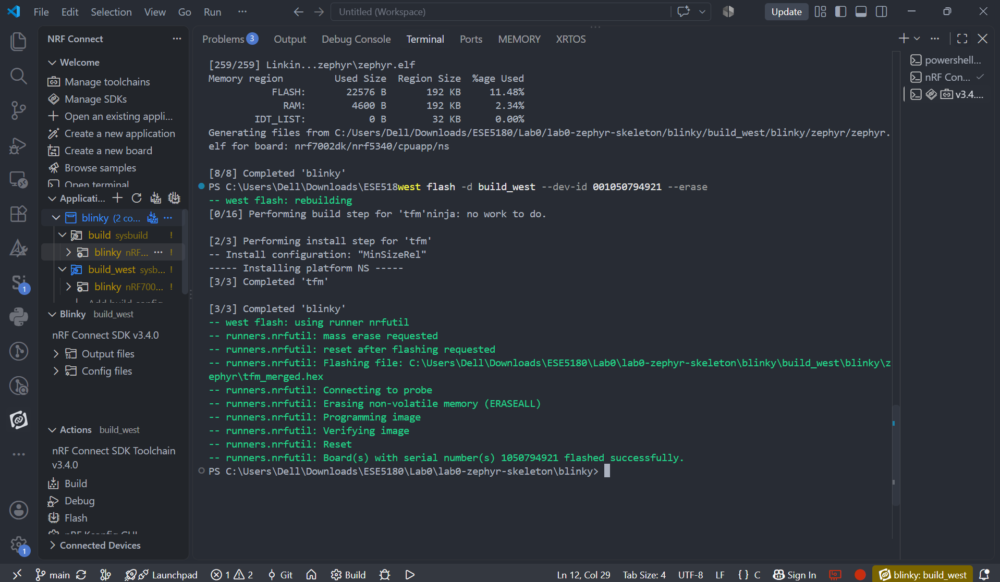
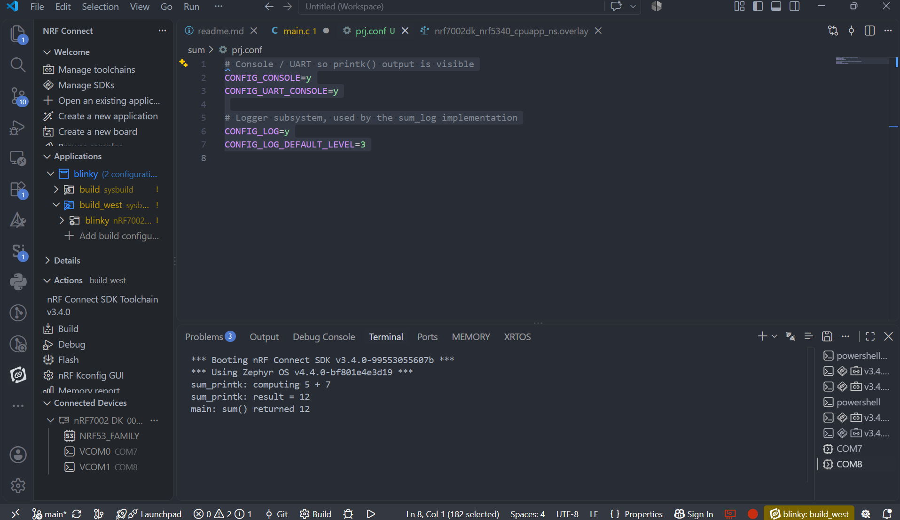
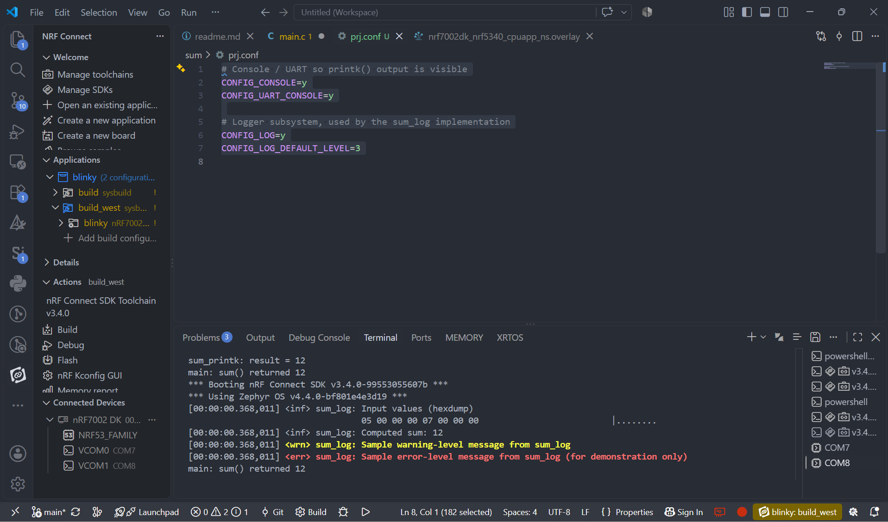

# ESE5180: Lab 0 Zephyr

| Team Member Name | Email Address                  |
| ---------------- | ------------------------------ |
| Deepa Lokesha    | deepasr1@engineering.upenn.edu |

**GitHub Repository URL: [github.com/DeepaLokesha/lab0.git](https://github.com/DeepaLokesha/lab0.git)**

(1.1) Create a video showing blinky on all 3x MCU boards.
[drive.google.com/file/d/1MOml7tqNPhIuztVFVqcjrf9GH49uKyGE/view?usp=drive_link](https://drive.google.com/file/d/1MOml7tqNPhIuztVFVqcjrf9GH49uKyGE/view?usp=drive_link)

(2.1) Commit your Zephyr application to your GitHub repository
[github.com/DeepaLokesha/lab0.git](https://github.com/DeepaLokesha/lab0.git)

(2.2) Create a video showing the change in blinky behavior on the nRF7002DK

[drive.google.com/file/d/1olxMrAXM7og7ta9HKgVmGyfXPC0eONS7/view?usp=drive_link](https://drive.google.com/file/d/1olxMrAXM7og7ta9HKgVmGyfXPC0eONS7/view?usp=drive_link)

(3.1) Build and Flash using only west commands and not the GUI. Show the terminal prints by embedding a screenshot in your README.md.

(6.1) Take screenshots of console output for both builds:

(6.2) Make a short video showing hexdump, log, and printk.
[drive.google.com/file/d/1dpdtQi58VGnqcgS_g0-UkT-9CTGCYmNv/view?usp=drive_link](https://drive.google.com/file/d/1dpdtQi58VGnqcgS_g0-UkT-9CTGCYmNv/view?usp=drive_link)
